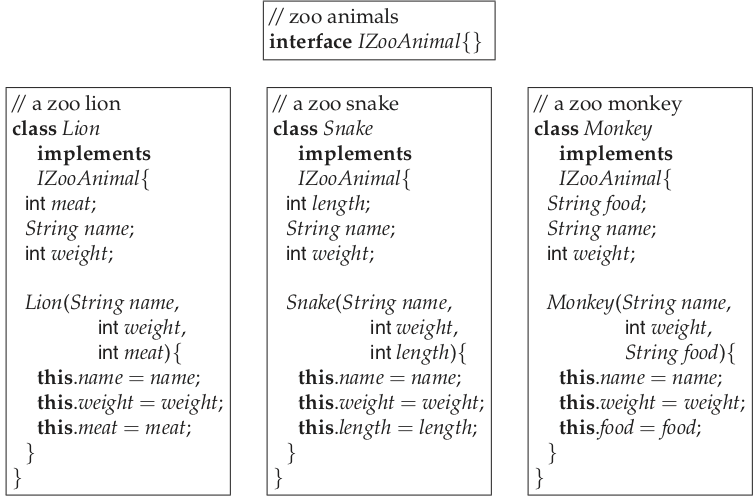

# **Lecture 3: Unions of Classes • Diagramming Classes & Objects**

# Objectives

## KNOW:
-  That no matter how data is represented across different programming languages, the information itself is the same, and thus the structure of the data representation is the same
- That an **interface** is the way to represent an itemization (union of classes) in Java
- That an interface allows multiple classes to fall under a common type name
- That a method specified by an interface must be defined with the same (`public`) signature in all classes that implement the interface
  
## BE ABLE TO:
- Design classes and methods for unions of data in Java
- Draw a diagram of classes and objects at a particular point in a given program

---
# Watch (before class)

- [Diagramming Classes & Objects](https://mediaspace.berry.edu/media/lecture2c-diagrams/0_ebi5kuhs) [12 mins]
- [Interfaces](https://mediaspace.berry.edu/media/lecture3a-interfaces/1_6yb9xsns) [20 mins]

--- 
# Practice (in class)

1.  Draw a **class diagram** for the following definitions:
    
    

2.  Draw an **object diagram** for the following instances:

        IZooAnimal leo = new Lion("Leo", 300, 5);
        IZooAnimal boa = new Snake("Ana", 150, 5);
        IZooAnimal george = new Monkey("George", 150, "kiwi");

3.  Consider the following problem statement:

    *. . . Develop a program that creates a gallery from three different kinds of media: images (gif), texts (txt), and sounds (mp3). All have names for source files and sizes (number of bytes). Images also include information about the height, the width, and the quality of the image. Texts specify the number of lines needed for visual representation. Sounds include information about the playing time of the recording, given in seconds. . . .*

    - Develop a data representation for these media. Draw a class diagram for your representation. Then represent these three examples with objects:
      - an image, stored in flower.gif; size: 57,234 bytes; width: 100 pixels; height: 50 pixels; quality: medium;
      - a text, stored in welcome.txt; size: 5,312 bytes; 830 lines;
      - a music piece, stored in theme.mp3; size: 40,960 bytes, playing time 3 minutes and 20 seconds.

    - Develop the following methods for this program:
      1. `timeToDownload`, which computes how long it takes to download a file at some given network connection speed (in bytes per second);
      2. `smallerThan`, which determines whether the file is smaller than some given maximum size;
      3. `sameName`, which determines whether the name of a file is the same as some given name.

---
# Assignment (for homework)

- [Here](work/hw03.md)

---
# Video Notes

---
# Credits

A large amount of material introduced in the first half of this course has been adopted and derived from materials prepared and developed by:

- **Kathi Fisler, et al. CS 2102: Object-Oriented Design Concepts @ Worcester Polytechnic Institute**
https://web.cs.wpi.edu/~cs2102/d17/Lectures/migrate.html

- **Leena Razzaq, Viera Proulx, et al. CS 2510: Fundamentals of Computer Science 2 @ Northeastern University**
https://course.ccs.neu.edu/cs2510/index.html

