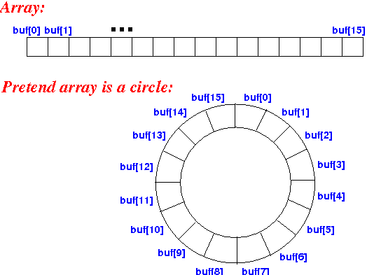

# Stack Implementations

Start a new BlueJ project named **hw23-stack** and copy the following files into it (click the "Raw" button and then "File" menu -> "Save" the files to download them).
- [IStack.java](IStack.java)
- [IPageTracker.java](IPageTracker.java)


---

# Task: Web Browser History Engine

Web browsers commonly allow you to navigate through a "history" of web pages that have previously been visited. The mechanism is somewhat like a stack, in that the most recently visited pages are at the top of the history and revisited when the "back" button is pressed. Many browsers also provide a "forward" button, which allows you to go back and forth in your recent history of page visits.

However, the history does not necessarily have unbounded capacity. In reality, there may exist a fixed limit on the size of the history. The issue arises as to what should happen when the capacity is exhausted and a new item is pushed onto the stack. One possibility is to throw an exception. But this is not how a Web browser behaves. If it only has room to save 50 pages in its history and yet you visit more pages, it will make room in the history for a new page by throwing away the page that is on the very bottom of the history (i.e., the least recently visited page). The general implementations of the `Stack` interface we defined in class (i.e. `ArrayStack`, `ListStack`) do not help, as they give us no way to directly access or remove the object on the *bottom* of the stack.

In this assignment, we define a new ADT that we call a `LeakyStack`. The interface for a `LeakyStack` is the same as that for a `Stack`. However in the case when the `capacity` is exhausted, a call to `push` will result in the placement of the new item at the expense of the loss of the least recently accessed item.


- ***Design and test*** a `LeakyStack` class that implements the `IStack<T>` interface provided above, but provides a bounded capacity for the stack. The constructor, `LeakyStack(int capacity)` , should take a single integer that establishes the fixed maximum capacity of the stack. If the capacity of the stack is exhausted, then items at the bottom of the stack should be removed before adding new items. (For full credit, avoid any loops (including the use of `System.arraycopy()`) in your implementation by using a **"circular" array** (\*\*see note at the bottom of the page).)
 

- ***Design and test*** a `Tracker` class that implements the `IPageTracker` interface in the file provided above. Use two `LeakyStack` objects as the fields of your `Tracker` class. You may add a `clear` method to your `LeakyStack` class to help implement some of the `IPageTracker` operations efficiently. (Do not add the `clear` method to the `IStack` interface, if you do that.)

Here is some test code, but you should develop your own additional thorough test cases:

```
    IPageTracker history = new Tracker(5);
    
    history.visit("berry.edu");
    history.visit("catalog");
    history.visit("cs.berry.edu");
    assertEquals("catalog", history.goBack(1));
    assertEquals("cs.berry.edu", history.goForward(1));
    
    history.visit("facebook");
    history.visit("friends");
    history.goBack(2);
    history.visit("linkedin");
    history.goBack(2);
    assertEquals("catalog", history.currentPage());
    history.goForward(2);
    history.visit("ebay");
    history.visit("google");
    history.visit("amazon");
    assertEquals("catalog", history.goBack(5));
    assertEquals("Home", history.goBack(1));
    assertEquals("catalog", history.goForward(1));
```


<div style="width: 40%; float: right; border: 1px solid black; padding-left: .5em;">
**The following diagram (rescued from <a href="https://web.archive.org/web/20220316010702/http://www.mathcs.emory.edu/~cheung/Courses/171/Syllabus/8-List/array-queue2.html">this page</a>) gives a sense of the concept of a "circular" array. You would need to allow the index of the <em>top</em>  of the stack  to progress back around to 0 once it reaches the end of the array. The modulo or remainder operator (<code>%</code> in Java) can be handy for this purpose. An expression like <code>(top + 1) % capacity</code> will increment an index forward, and make it "loop back" around to 0 when it reaches the last index in the array, assuming the array has <code>capacity</code> elements in it.



 <p>&nbsp;</p>
</div>

- Here's a [video with hints on implementing the leaky stack](https://berry.zoom.us/rec/share/6CWZhf90rNckfTeIpMP92nB50bWJTkUvNS2PiE9papbPb5J3_ZGhaHltdOz_uk85.6Rpe8f7g9s5-wj0z?startTime=1602684379000).
